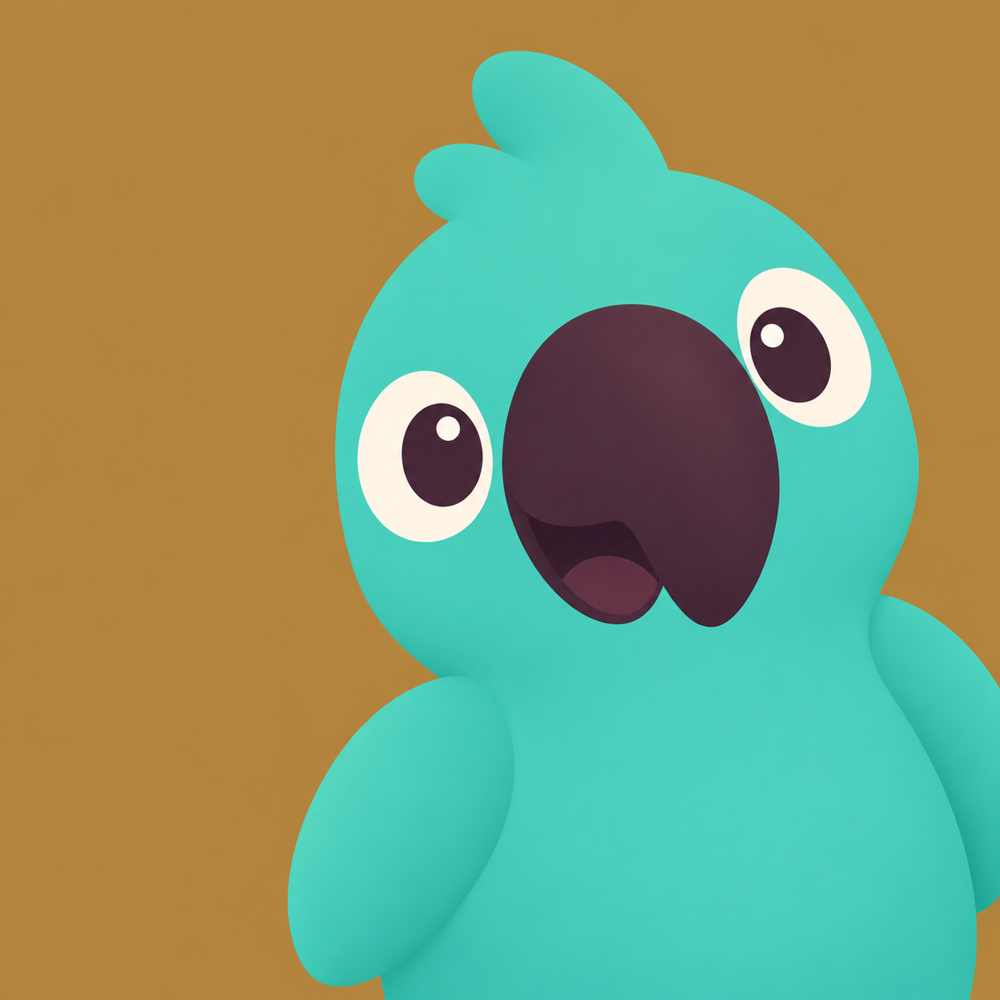

<p align="center">
  
</p>

<h1 align="center">parrotpane</h1>

<p align="center">
Share one Ghostty pane in Discord, Zoom or Meet, with that pane's audio.
</p>

Screen sharing apps let you pick a window or a whole screen, never a region. Terminal
browsers make that worse: they render offscreen and send frames to the terminal, so their
own window is empty and the picture only exists inside Ghostty. Sharing the Ghostty window
would show every other pane too.

parrotpane captures the Ghostty window, shows only the pane you pick in a window of its own,
and plays that pane's audio through itself so the sharing app picks up sound as well.

## Install

```
make
make install
```

`make install` links `bin/parrotpane` into `~/.local/bin`.

## Use

```
parrotpane open <url>   open the url in this pane and mirror it
parrotpane list         list every Ghostty pane
parrotpane <n>          mirror pane n
```

Then share the window called ParrotPane.

`open` starts the browser with `--no-toolbar --no-frame --no-merge`, so the page fills the
pane with no URL bar or tab strip and nothing needs cropping.

## How it works

Pane positions come from Ghostty's Accessibility tree, which is the only interface that
reports where a pane is. Video comes from ScreenCaptureKit capturing the whole Ghostty
window, cropped in the view so a dragged split divider costs a layer change instead of
restarting the capture. Audio comes from a Core Audio process tap on the browser's own
processes. ScreenCaptureKit cannot see the Electron helper that produces browser sound,
Core Audio can, and tapping only the browser means the call audio never gets captured and
echoed back.

## Notes

Needs macOS 14.4 or later, Ghostty, and permission for Screen Recording and Accessibility.
